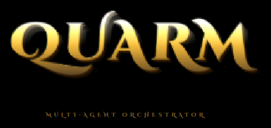

<p align="center">
  
</p>

# 4-Layer Multi-Agent Orchestrator

A LangGraph system with two independent quality gates: domain manager review and a specialist reviewer panel (security engineer, UX designer, user tester).

## Architecture

```
MASTER  (Program Manager — dispatches tasks, synthesises final report)
  │
  ▼
SUB-AGENT  (executes task — specialist with a defined role and toolset)
  │
  ▼
MANAGER REVIEW  ── Quality Gate 1 ─────────────────────────────────────────
  │  Blended domain expertise. Reviews for correctness, completeness,
  │  and adherence to requirements.
  │  FAIL → feedback → sub-agent revises
  │  PASS ↓
  ▼
SPECIALIST REVIEW PANEL  ── Quality Gate 2 ────────────────────────────────
  ├── Security Engineer   Checks: OWASP, auth, secrets, input validation,
  │                       access control, dependency risk, data handling
  │
  ├── UX/UI Designer      Checks: visual hierarchy, WCAG accessibility,
  │                       information architecture, interaction patterns,
  │                       typography, cognitive load
  │
  └── User Tester         Checks: clarity of purpose, ease of first use,
                          plain language, workflow intuitiveness,
                          actual value delivered to a real user
  │
  │  Any reviewer FLAGs → consolidated feedback → sub-agent revises
  │  All PASS ↓
  ▼
DONE  (result stored, Master picks next task)
```

## The specialist reviewers

Three built-in reviewer personas are always available. Tasks opt-in by listing them in `reviewers:`.

| Reviewer | Domain | When to assign |
|---|---|---|
| `security_engineer` | OWASP, auth, secrets, least-privilege | Any task with code, APIs, auth, config, infrastructure |
| `ux_designer` | WCAG, visual hierarchy, interaction patterns | Any user-facing UI, dashboard, form, report |
| `user_tester` | First-use clarity, plain language, workflow | Any output a non-technical user will touch |

### Reviewer assignment guide

```
Backend API only:          reviewers: [security_engineer]
Frontend component:        reviewers: [security_engineer, ux_designer, user_tester]
Internal data pipeline:    reviewers: []
User-facing documentation: reviewers: [ux_designer, user_tester]
Auth architecture:         reviewers: [security_engineer]
```

## Install

```bash
pip install langgraph langchain langchain-anthropic python-dotenv anthropic
```

`.env`:
```
ANTHROPIC_API_KEY=sk-ant-...
```

## Usage

### Auto-generate a plan
```bash
python generate_plan.py "Build a web dashboard for AWS cost monitoring"
# Writes plan.md with agents, managers, tasks, and reviewer assignments
```

### Run the orchestrator
```bash
python orchestrator.py plan.md
# Streams review decisions to stdout in real time
# Writes results.json on completion
```

## plan.md Schema

```markdown
## Sub-Agents
### AGENT: backend_engineer
- description: What this specialist does and their output format
- tools: execute_code, write_file, analyze_data, ...

## Managers
### MANAGER: engineering_director
- title: Engineering Architecture Director
- description: What domain this manager owns
- expertise_blend: [API_design, secure_coding, AWS, performance]
- oversees: [backend_engineer, security_architect]

## Tasks
### TASK-001
- title: Build auth layer
- agent: security_architect
- description: Detailed, specific instructions
- task_type: [auth, security, config]
- reviewers: [security_engineer]
- depends_on: []

### TASK-002
- title: Build dashboard UI
- agent: frontend_engineer
- description: Detailed instructions
- task_type: [ui, frontend, dashboard]
- reviewers: [security_engineer, ux_designer, user_tester]
- depends_on: [TASK-001]
```

## results.json

```json
{
  "objective": "...",
  "quality_log": [
    {
      "id": "TASK-001",
      "title": "Design auth architecture",
      "agent": "security_architect",
      "status": "done",
      "revision_count": 1
    }
  ],
  "task_results": { "TASK-001": "...", "TASK-002": "..." },
  "summary": "Final master report..."
}
```

`revision_count` in the quality log tells you which tasks needed rework and how many cycles — a useful signal for evaluating sub-agent quality or prompt quality over time.

## Configuration

`MAX_REVISIONS = 3` in `orchestrator.py` — applies per task across both review gates combined.

## Custom reviewers

You can define project-specific reviewers in plan.md alongside the builtins:

```markdown
## Custom Reviewers
### REVIEWER: compliance_officer
- title: Regulatory Compliance Officer
- description: Reviews outputs for HIPAA/GDPR compliance...
- focus_areas: [data_minimization, consent_flows, audit_logging, PII_handling]
- applies_to: [data, api, auth, report]
```

Custom reviewers with the same name as a builtin will override the builtin.

## Extending

- **Parallel reviewer dispatch**: Replace sequential reviewer loop with LangGraph `Send()` API to fan out all reviewers simultaneously, then join results
- **Real tools**: Inject LangChain tools (Tavily search, shell exec, file write) into sub-agents based on their `tools:` field
- **Human-in-the-loop**: Add a `human_escalation` node for any task that exceeds `MAX_REVISIONS` — pause the graph and wait for human input via LangGraph interrupt
- **Checkpointing**: Use LangGraph's SQLite checkpointer to persist state and resume failed runs at the exact node where they stopped
- **Quality metrics**: Log reviewer scores over time to identify which sub-agents or task types consistently need more revision cycles
